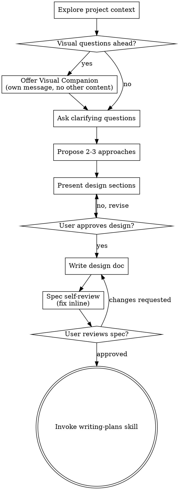

# Brainstorming Ideas Into Designs

Turn ideas into fully formed designs and specs through natural collaborative dialogue.

Start by understanding project context, then ask questions one at a time to refine idea. Once you understand what you're building, present design and get user approval.

<HARD-GATE>
Do NOT invoke any implementation skill, write any code, scaffold any project, or take any implementation action until you have presented a design and the user has approved it. This applies to EVERY project regardless of perceived simplicity.
</HARD-GATE>

## Anti-Pattern: "Too Simple To Need Design"

Every project goes through this. Todo list, single-function utility, config change. "Simple" projects = where unexamined assumptions cause most wasted work. Design can be short (few sentences for truly simple projects), but you MUST present it and get approval.

## Checklist

Complete in order:

1. **Explore project context** - check files, docs, recent commits
2. **Offer visual companion** (if topic involves visual questions) - own message, not combined with question. See Visual Companion section.
3. **Ask clarifying questions** - one at a time, understand purpose/constraints/success criteria
4. **Propose 2-3 approaches** - with trade-offs and recommendation
5. **Present design** - sections scaled to complexity, get user approval after each
6. **Write design doc** - save to `docs/superpowers/specs/YYYY-MM-DD-<topic>-design.md` and commit
7. **Spec self-review** - check for placeholders, contradictions, ambiguity, scope
8. **User reviews written spec** - ask user to review before proceeding
9. **Transition to implementation** - invoke writing-plans skill

## Process Flow

**Terminal state = invoking writing-plans.** Do NOT invoke frontend-design, mcp-builder, or any other implementation skill. ONLY writing-plans after brainstorming.

## The Process

**Understanding the idea:**
- Check current project state first (files, docs, recent commits)
- Before detailed questions, assess scope: if request describes multiple independent subsystems, flag immediately. Don't spend questions refining details of project needing decomposition first.
- Too large for single spec? Help decompose into sub-projects. Each sub-project gets own spec -> plan -> implementation cycle.
- Ask questions one at a time
- Prefer multiple choice questions, open-ended fine too
- One question per message
- Focus: purpose, constraints, success criteria

**Exploring approaches:**
- Propose 2-3 approaches with trade-offs
- Lead with recommended option and reasoning

**Presenting design:**
- Scale each section to its complexity: few sentences if straightforward, 200-300 words if nuanced
- Ask after each section if it looks right
- Cover: architecture, components, data flow, error handling, testing

**Design for isolation and clarity:**
- Break into smaller units: one clear purpose, well-defined interfaces, independently testable
- Each unit: what does it do, how to use it, what does it depend on?
- Smaller well-bounded units easier to work with - better reasoning about code in context, more reliable edits when files focused

**Working in existing codebases:**
- Explore current structure before proposing changes. Follow existing patterns.
- Where existing code has problems affecting work, include targeted improvements in design
- No unrelated refactoring. Stay focused on current goal.

## After the Design

**Documentation:**
- Write spec to `docs/superpowers/specs/YYYY-MM-DD-<topic>-design.md`
- Commit design document to git

**Spec Self-Review:**
1. **Placeholder scan:** Any "TBD", "TODO", incomplete sections? Fix.
2. **Internal consistency:** Sections contradict? Architecture match feature descriptions?
3. **Scope check:** Focused enough for single plan, or needs decomposition?
4. **Ambiguity check:** Requirement interpreted two ways? Pick one, make explicit.

Fix issues inline. No re-review needed.

**User Review Gate:**
> "Spec written and committed to `<path>`. Please review before we start writing implementation plan."

Wait for response. Changes requested: make them, re-run spec review. Only proceed once approved.

**Implementation:**
- Invoke writing-plans skill. Do NOT invoke any other skill.

## Key Principles

- **One question at a time** - Don't overwhelm
- **Multiple choice preferred** - Easier than open-ended when possible
- **YAGNI ruthlessly** - Remove unnecessary features
- **Explore alternatives** - Always 2-3 approaches before settling
- **Incremental validation** - Present design, get approval before moving on

## Visual Companion

Browser-based companion for showing mockups, diagrams, visual options. Tool, not mode. Accepting means available for visual questions; NOT every question goes through browser.

**Offering:** When upcoming questions involve visual content:
> "Some of what we're working on might be easier to explain in a web browser. I can show mockups, diagrams, comparisons. This feature is still new and can be token-intensive. Want to try it? (Requires opening a local URL)"

**This offer MUST be its own message.** No combining with questions or other content. Wait for response.

**Per-question decision:** Even after user accepts, decide FOR EACH QUESTION: browser or terminal? Test: **would user understand better by seeing it than reading it?**

- **Browser:** content that IS visual - mockups, wireframes, layout comparisons, architecture diagrams
- **Terminal:** content that is text - requirements questions, conceptual choices, tradeoff lists

If they agree, read detailed guide: `skills/brainstorming/visual-companion.md`
