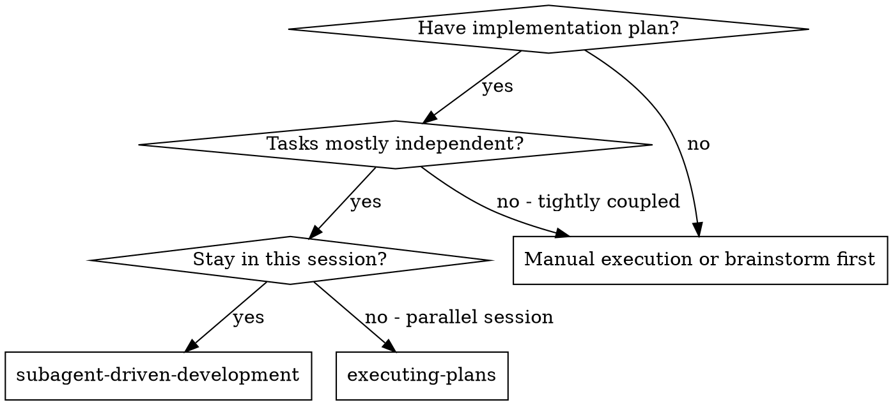
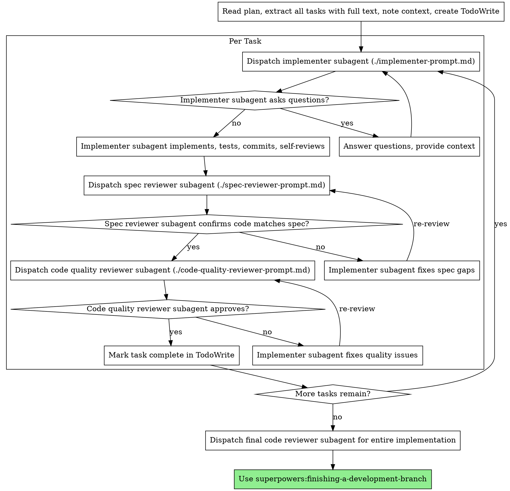

# Subagent-Driven Development

Execute plan by dispatching fresh subagent per task, with two-stage review: spec compliance first, then code quality.

**Why subagents:** Craft instructions precisely. Subagents never inherit session context/history. Preserves your context for coordination.

**Core principle:** Fresh subagent per task + two-stage review (spec then quality) = high quality, fast iteration

## When to Use



**vs. Executing Plans:**
- Same session, no context switch
- Fresh subagent per task, no context pollution
- Two-stage review: spec compliance then code quality
- Faster iteration, no human-in-loop between tasks

## The Process



## Model Selection

Use least powerful model that handles each role.

**Mechanical tasks** (isolated fns, clear specs, 1-2 files): cheap model. Most tasks mechanical when plan well-specified.

**Integration/judgment tasks** (multi-file, pattern matching, debugging): standard model.

**Architecture/design/review**: most capable model.

**Signals:**
- 1-2 files + complete spec -> cheap
- Multiple files + integration -> standard
- Design judgment or broad codebase understanding -> capable

## Handling Implementer Status

**DONE:** Proceed to spec review.

**DONE_WITH_CONCERNS:** Read concerns. Correctness/scope concerns: address before review. Observations ("file getting large"): note, proceed.

**NEEDS_CONTEXT:** Provide missing context, re-dispatch.

**BLOCKED:** Assess blocker:
1. Context problem: more context, re-dispatch same model
2. Needs more reasoning: re-dispatch capable model
3. Task too large: break into pieces
4. Plan wrong: escalate to Calum

**Never** ignore escalation or force retry without changes.

## Prompt Templates

- `./implementer-prompt.md` - Implementer subagent
- `./spec-reviewer-prompt.md` - Spec compliance reviewer
- `./code-quality-reviewer-prompt.md` - Code quality reviewer

## Example Workflow

```
You: I'm using Subagent-Driven Development to execute this plan.

[Read plan file once: docs/superpowers/plans/feature-plan.md]
[Extract all 5 tasks with full text and context]
[Create TodoWrite with all tasks]

Task 1: Hook installation script

[Get Task 1 text and context (already extracted)]
[Dispatch implementation subagent with full task text + context]

Implementer: "Before I begin - should the hook be installed at user or system level?"

You: "User level (~/.config/superpowers/hooks/)"

Implementer: "Got it. Implementing now..."
[Later] Implementer:
  - Implemented install-hook command
  - Added tests, 5/5 passing
  - Self-review: Found I missed --force flag, added it
  - Committed

[Dispatch spec compliance reviewer]
Spec reviewer: ✅ Spec compliant - all requirements met, nothing extra

[Get git SHAs, dispatch code quality reviewer]
Code reviewer: Strengths: Good test coverage, clean. Issues: None. Approved.

[Mark Task 1 complete]

Task 2: Recovery modes

[Get Task 2 text and context (already extracted)]
[Dispatch implementation subagent with full task text + context]

Implementer: [No questions, proceeds]
Implementer:
  - Added verify/repair modes
  - 8/8 tests passing
  - Self-review: All good
  - Committed

[Dispatch spec compliance reviewer]
Spec reviewer: ❌ Issues:
  - Missing: Progress reporting (spec says "report every 100 items")
  - Extra: Added --json flag (not requested)

[Implementer fixes issues]
Implementer: Removed --json flag, added progress reporting

[Spec reviewer reviews again]
Spec reviewer: ✅ Spec compliant now

[Dispatch code quality reviewer]
Code reviewer: Strengths: Solid. Issues (Important): Magic number (100)

[Implementer fixes]
Implementer: Extracted PROGRESS_INTERVAL constant

[Code reviewer reviews again]
Code reviewer: ✅ Approved

[Mark Task 2 complete]

...

[After all tasks]
[Dispatch final code-reviewer]
Final reviewer: All requirements met, ready to merge

Done!
```

## Advantages

**vs. Manual:** TDD natural, fresh context per task, parallel-safe, subagent asks questions

**vs. Executing Plans:** Same session, continuous progress, automatic review checkpoints

**Efficiency:** No file reading overhead, controller curates context, complete info upfront, questions surfaced early

**Quality:** Self-review + two-stage review, review loops ensure fixes work, spec compliance prevents over/under-building

**Cost:** More invocations (implementer + 2 reviewers per task), more prep work, review loops add iterations. But catches issues early = cheaper than debugging later.

## Red Flags

**Never:**
- Start on main/master without explicit consent
- Skip reviews (spec OR quality)
- Proceed with unfixed issues
- Dispatch multiple implementers in parallel
- Make subagent read plan file (provide full text)
- Skip scene-setting context
- Ignore subagent questions
- Accept "close enough" on spec compliance
- Skip review loops
- Let self-review replace actual review
- **Start quality review before spec compliance passes**
- Move to next task with open review issues

**Subagent asks questions:** Answer clearly, provide context, don't rush.

**Reviewer finds issues:** Implementer fixes -> reviewer re-reviews -> repeat until approved.

**Subagent fails:** Dispatch fix subagent. Don't fix manually (context pollution).

## Integration

**Required:**
- **superpowers:using-git-worktrees** - Isolated workspace before starting
- **superpowers:writing-plans** - Creates plan this executes
- **superpowers:requesting-code-review** - Review template for reviewers
- **superpowers:finishing-a-development-branch** - Complete after all tasks

**Subagents use:** **superpowers:test-driven-development**

**Alternative:** **superpowers:executing-plans** for parallel session execution
