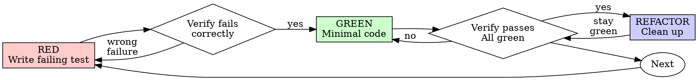

# Test-Driven Development (TDD)

## Overview

Write test first. Watch it fail. Write minimal code to pass.

**Core principle:** Didn't watch test fail? Don't know if it tests right thing.

**Violating the letter of the rules is violating the spirit of the rules.**

## When to Use

**Always:** New features, bug fixes, refactoring, behavior changes.

**Exceptions (ask Calum):** Throwaway prototypes, generated code, config files.

Thinking "skip TDD just this once"? Stop. Rationalization.

## The Iron Law

```
NO PRODUCTION CODE WITHOUT A FAILING TEST FIRST
```

Wrote code before test? Delete it. Start over.

**No exceptions:**
- Don't keep as "reference"
- Don't "adapt" while writing tests
- Don't look at it
- Delete means delete

Implement fresh from tests. Period.

## Red-Green-Refactor



### RED - Write Failing Test

One minimal test showing what should happen.

<Good>
```typescript
test('retries failed operations 3 times', async () => {
  let attempts = 0;
  const operation = () => {
    attempts++;
    if (attempts < 3) throw new Error('fail');
    return 'success';
  };

  const result = await retryOperation(operation);

  expect(result).toBe('success');
  expect(attempts).toBe(3);
});
```
Clear name, tests real behavior, one thing
</Good>

<Bad>
```typescript
test('retry works', async () => {
  const mock = jest.fn()
    .mockRejectedValueOnce(new Error())
    .mockRejectedValueOnce(new Error())
    .mockResolvedValueOnce('success');
  await retryOperation(mock);
  expect(mock).toHaveBeenCalledTimes(3);
});
```
Vague name, tests mock not code
</Bad>

**Requirements:** One behavior. Clear name. Real code (no mocks unless unavoidable).

### Verify RED - Watch It Fail

**MANDATORY. Never skip.**

```bash
npm test path/to/test.test.ts
```

Confirm:
- Test fails (not errors)
- Failure message expected
- Fails because feature missing (not typos)

Test passes? Testing existing behavior. Fix test.
Test errors? Fix error, re-run until fails correctly.

### GREEN - Minimal Code

Simplest code to pass test.

<Good>
```typescript
async function retryOperation<T>(fn: () => Promise<T>): Promise<T> {
  for (let i = 0; i < 3; i++) {
    try {
      return await fn();
    } catch (e) {
      if (i === 2) throw e;
    }
  }
  throw new Error('unreachable');
}
```
Enough to pass
</Good>

<Bad>
```typescript
async function retryOperation<T>(
  fn: () => Promise<T>,
  options?: {
    maxRetries?: number;
    backoff?: 'linear' | 'exponential';
    onRetry?: (attempt: number) => void;
  }
): Promise<T> {
  // YAGNI
}
```
Over-engineered
</Bad>

Don't add features, refactor other code, or "improve" beyond test.

### Verify GREEN

**MANDATORY.**

```bash
npm test path/to/test.test.ts
```

Confirm: test passes, other tests pass, output pristine (no errors/warnings).

Test fails? Fix code, not test. Other tests fail? Fix now.

### REFACTOR

After green only: remove duplication, improve names, extract helpers. Keep tests green. Don't add behavior.

## Good Tests

| Quality | Good | Bad |
|---------|------|-----|
| **Minimal** | One thing. "and" in name? Split. | `test('validates email and domain and whitespace')` |
| **Clear** | Name describes behavior | `test('test1')` |
| **Shows intent** | Demonstrates desired API | Obscures what code should do |

## Why Order Matters

**"Write tests after to verify"** - Tests written after pass immediately. Proves nothing: might test wrong thing, implementation not behavior, miss edge cases. Test-first forces you to see fail = proves tests something.

**"Already manually tested"** - No record, can't re-run, easy to forget cases. Automated tests run same way every time.

**"Deleting X hours wasteful"** - Sunk cost. Keeping code you can't trust = technical debt.

**"TDD is dogmatic"** - TDD IS pragmatic: finds bugs before commit, prevents regressions, documents behavior, enables refactoring. "Pragmatic" shortcuts = debugging in production = slower.

**"Tests after achieve same goals"** - No. Tests-after = "what does this do?" Tests-first = "what should this do?" Tests-after biased by implementation. 30 min tests-after != TDD.

## Common Rationalizations

| Excuse | Reality |
|--------|---------|
| "Too simple to test" | Simple code breaks. Test takes 30 seconds. |
| "I'll test after" | Tests passing immediately prove nothing. |
| "Tests after = same goals" | Tests-after = "what does this do?" not "what should this do?" |
| "Already manually tested" | Ad-hoc != systematic. No record, can't re-run. |
| "Deleting X hours wasteful" | Sunk cost. Unverified code = debt. |
| "Keep as reference" | You'll adapt it. That's testing after. Delete = delete. |
| "Need to explore first" | Fine. Throw away exploration, start with TDD. |
| "Test hard = design unclear" | Listen to test. Hard to test = hard to use. |
| "TDD will slow me down" | TDD faster than debugging. |

## Red Flags - STOP and Start Over

- Code before test
- Test after implementation
- Test passes immediately
- Can't explain why test failed
- Tests added "later"
- "Just this once"
- "Already manually tested it"
- "Tests after achieve same purpose"
- "Keep as reference" or "adapt existing code"
- "Already spent X hours, deleting wasteful"
- "TDD is dogmatic, I'm being pragmatic"

**All mean: Delete code. Start over with TDD.**

## Example: Bug Fix

**Bug:** Empty email accepted

**RED**
```typescript
test('rejects empty email', async () => {
  const result = await submitForm({ email: '' });
  expect(result.error).toBe('Email required');
});
```

**Verify RED**
```bash
$ npm test
FAIL: expected 'Email required', got undefined
```

**GREEN**
```typescript
function submitForm(data: FormData) {
  if (!data.email?.trim()) {
    return { error: 'Email required' };
  }
  // ...
}
```

**Verify GREEN**
```bash
$ npm test
PASS
```

**REFACTOR** - Extract validation for multiple fields if needed.

## Verification Checklist

Before marking complete:

- [ ] Every new function/method has test
- [ ] Watched each test fail before implementing
- [ ] Each test failed for expected reason
- [ ] Wrote minimal code to pass each test
- [ ] All tests pass
- [ ] Output pristine
- [ ] Tests use real code (mocks only if unavoidable)
- [ ] Edge cases and errors covered

Can't check all? Skipped TDD. Start over.

## When Stuck

| Problem | Solution |
|---------|----------|
| Don't know how to test | Write wished-for API. Assertion first. Ask Calum. |
| Test too complicated | Design too complicated. Simplify interface. |
| Must mock everything | Code too coupled. Dependency injection. |
| Test setup huge | Extract helpers. Still complex? Simplify design. |

## Testing Anti-Patterns

When adding mocks or test utilities, read @testing-anti-patterns.md:
- Testing mock behavior instead of real behavior
- Adding test-only methods to production classes
- Mocking without understanding dependencies

## Final Rule

```
Production code -> test exists and failed first
Otherwise -> not TDD
```

No exceptions without Calum's permission.
