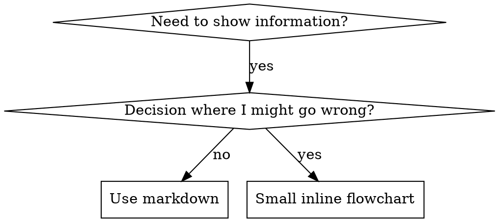

# Writing Skills

## Overview

**Writing skills IS TDD applied to process documentation.**

**Personal skills live in agent-specific dirs (`~/.claude/skills` for Claude Code, `~/.agents/skills/` for Codex)**

Write test cases (pressure scenarios with subagents), watch them fail (baseline), write skill (documentation), watch tests pass (agents comply), refactor (close loopholes).

**Core principle:** Didn't watch agent fail without skill? Don't know if skill teaches right thing.

**REQUIRED BACKGROUND:** Must understand superpowers:test-driven-development first. Defines RED-GREEN-REFACTOR cycle. This skill adapts TDD to documentation.

**Official guidance:** See anthropic-best-practices.md for Anthropic's official skill authoring best practices.

## What is a Skill?

Reference guide for proven techniques, patterns, or tools.

**Skills are:** Reusable techniques, patterns, tools, reference guides
**Skills are NOT:** Narratives about solving a problem once

## TDD Mapping for Skills

| TDD Concept | Skill Creation |
|-------------|----------------|
| **Test case** | Pressure scenario with subagent |
| **Production code** | Skill document (SKILL.md) |
| **Test fails (RED)** | Agent violates rule without skill (baseline) |
| **Test passes (GREEN)** | Agent complies with skill present |
| **Refactor** | Close loopholes maintaining compliance |
| **Write test first** | Run baseline scenario BEFORE writing skill |
| **Watch it fail** | Document exact rationalizations agent uses |
| **Minimal code** | Write skill addressing those specific violations |
| **Watch it pass** | Verify agent now complies |
| **Refactor cycle** | Find new rationalizations -> plug -> re-verify |

## When to Create a Skill

**Create when:**
- Technique wasn't intuitively obvious
- You'd reference again across projects
- Pattern applies broadly (not project-specific)
- Others would benefit

**Don't create for:**
- One-off solutions
- Standard practices well-documented elsewhere
- Project-specific conventions (put in CLAUDE.md)
- Mechanical constraints (enforceable with regex/validation? Automate it)

## Skill Types

### Technique
Concrete method with steps (condition-based-waiting, root-cause-tracing)

### Pattern
Way of thinking about problems (flatten-with-flags, test-invariants)

### Reference
API docs, syntax guides, tool documentation

## Directory Structure

```
skills/
  skill-name/
    SKILL.md              # Main reference (required)
    supporting-file.*     # Only if needed
```

**Flat namespace** - all skills in one searchable namespace

**Separate files for:**
1. **Heavy reference** (100+ lines) - API docs, comprehensive syntax
2. **Reusable tools** - Scripts, utilities, templates

**Keep inline:** Principles, code patterns (< 50 lines), everything else

## SKILL.md Structure

**Frontmatter (YAML):**
- Two required fields: `name` and `description` (see [agentskills.io/specification](https://agentskills.io/specification))
- Max 1024 characters total
- `name`: Letters, numbers, hyphens only
- `description`: Third-person, ONLY when to use (NOT what it does)
  - Start with "Use when..."
  - Include specific symptoms, situations, contexts
  - **NEVER summarize skill's process or workflow** (see CSO section)
  - Keep under 500 chars if possible

```markdown
---
name: Skill-Name-With-Hyphens
description: Use when [specific triggering conditions and symptoms]
---

# Skill Name

## Overview
What is this? Core principle in 1-2 sentences.

## When to Use
[Small inline flowchart IF decision non-obvious]
Bullet list with SYMPTOMS and use cases
When NOT to use

## Core Pattern (for techniques/patterns)
Before/after code comparison

## Quick Reference
Table or bullets for scanning

## Implementation
Inline code for simple patterns
Link to file for heavy reference

## Common Mistakes
What goes wrong + fixes

## Real-World Impact (optional)
Concrete results
```

## Claude Search Optimization (CSO)

### 1. Rich Description Field

Claude reads description to decide which skills to load. Answer: "Should I read this skill right now?"

**CRITICAL: Description = When to Use, NOT What Skill Does**

Description should ONLY describe triggering conditions. Do NOT summarize workflow.

**Why:** Testing revealed descriptions summarizing workflow cause Claude to follow description instead of reading full skill. Description saying "code review between tasks" caused ONE review, even though flowchart showed TWO reviews (spec then quality).

Changed to "Use when executing implementation plans with independent tasks" -> Claude correctly read flowchart and followed two-stage review.

**Trap:** Descriptions summarizing workflow create shortcut Claude takes. Skill body becomes skipped documentation.

```yaml
# X BAD: Summarizes workflow
description: Use when executing plans - dispatches subagent per task with code review between tasks

# V GOOD: Triggering conditions only
description: Use when executing implementation plans with independent tasks in the current session
```

**Content:**
- Concrete triggers, symptoms, situations
- Describe problem (race conditions) not language-specific symptoms (setTimeout)
- Technology-agnostic unless skill is technology-specific
- Third person
- **NEVER summarize workflow**

### 2. Keyword Coverage

Use words Claude would search for:
- Error messages: "Hook timed out", "ENOTEMPTY", "race condition"
- Symptoms: "flaky", "hanging", "zombie", "pollution"
- Synonyms: "timeout/hang/freeze", "cleanup/teardown/afterEach"
- Tools: Commands, library names, file types

### 3. Descriptive Naming

Active voice, verb-first:
- V `creating-skills` not `skill-creation`
- V `condition-based-waiting` not `async-test-helpers`

### 4. Token Efficiency (Critical)

**Target word counts:**
- getting-started workflows: <150 words
- Frequently-loaded skills: <200 words
- Other skills: <500 words

**Techniques:**

**Move details to tool help:**
```bash
# V GOOD: Reference --help
search-conversations supports multiple modes and filters. Run --help for details.
```

**Use cross-references:**
```markdown
# V GOOD: Reference other skill
Always use subagents (50-100x context savings). REQUIRED: Use [other-skill-name] for workflow.
```

**Compress examples:** One minimal example beats verbose ones.

**Eliminate redundancy:** Don't repeat cross-referenced skills, don't explain obvious, one example per pattern.

### 5. Cross-Referencing Other Skills

Use skill name with explicit markers:
- V `**REQUIRED SUB-SKILL:** Use superpowers:test-driven-development`
- V `**REQUIRED BACKGROUND:** You MUST understand superpowers:systematic-debugging`
- X `See skills/testing/test-driven-development` (unclear if required)
- X `@skills/testing/test-driven-development/SKILL.md` (force-loads, burns context)

**Why no @ links:** `@` syntax force-loads files, consuming 200k+ context before needed.

## Flowchart Usage



**Use flowcharts ONLY for:** Non-obvious decisions, process loops, "A vs B" decisions

**Never for:** Reference material, code examples, linear instructions

See @graphviz-conventions.dot for style rules.

**Visualizing:** Use `render-graphs.js` to render flowcharts to SVG:
```bash
./render-graphs.js ../some-skill           # Each diagram separately
./render-graphs.js ../some-skill --combine # All in one SVG
```

## Code Examples

**One excellent example beats many mediocre ones.**

Choose most relevant language. Complete, runnable, well-commented (WHY), from real scenario, shows pattern clearly. Don't implement in 5+ languages or create fill-in-the-blank templates.

## File Organization

### Self-Contained Skill
```
defense-in-depth/
  SKILL.md    # Everything inline
```

### Skill with Reusable Tool
```
condition-based-waiting/
  SKILL.md    # Overview + patterns
  example.ts  # Working helpers to adapt
```

### Skill with Heavy Reference
```
pptx/
  SKILL.md       # Overview + workflows
  pptxgenjs.md   # 600 lines API reference
  ooxml.md       # 500 lines XML structure
  scripts/       # Executable tools
```

## The Iron Law (Same as TDD)

```
NO SKILL WITHOUT A FAILING TEST FIRST
```

Applies to NEW skills AND EDITS to existing skills.

Wrote skill before testing? Delete it. Start over.

**No exceptions:** Not for "simple additions", "just adding section", "documentation updates". Delete means delete.

## Testing All Skill Types

### Discipline-Enforcing Skills (rules/requirements)
**Test with:** Academic questions, pressure scenarios, multiple pressures combined. Identify rationalizations, add explicit counters.
**Success:** Agent follows rule under maximum pressure.

### Technique Skills (how-to guides)
**Test with:** Application scenarios, variation scenarios, missing information tests.
**Success:** Agent successfully applies technique to new scenario.

### Pattern Skills (mental models)
**Test with:** Recognition scenarios, application scenarios, counter-examples.
**Success:** Agent correctly identifies when/how to apply.

### Reference Skills (documentation/APIs)
**Test with:** Retrieval scenarios, application scenarios, gap testing.
**Success:** Agent finds and correctly applies reference info.

## Common Rationalizations for Skipping Testing

| Excuse | Reality |
|--------|---------|
| "Skill obviously clear" | Clear to you != clear to agents. Test. |
| "Just a reference" | References have gaps. Test retrieval. |
| "Testing overkill" | Untested skills have issues. Always. |
| "Test if problems emerge" | Problems = agents can't use skill. Test BEFORE. |
| "Too tedious to test" | Less tedious than debugging bad skill in prod. |
| "Confident it's good" | Overconfidence guarantees issues. Test anyway. |

## Bulletproofing Against Rationalization

Skills enforcing discipline need to resist rationalization. Agents find loopholes under pressure.

**Psychology:** See persuasion-principles.md for research foundation (Cialdini, 2021; Meincke et al., 2025).

### Close Every Loophole Explicitly

Don't just state rule - forbid specific workarounds:

<Good>
```markdown
Write code before test? Delete it. Start over.

**No exceptions:**
- Don't keep it as "reference"
- Don't "adapt" it while writing tests
- Don't look at it
- Delete means delete
```
</Good>

### Address "Spirit vs Letter" Arguments

Add early: `**Violating the letter of the rules is violating the spirit of the rules.**`

### Build Rationalization Table

Capture rationalizations from baseline testing. Every excuse goes in table.

### Create Red Flags List

Self-check list for when rationalizing.

### Update CSO for Violation Symptoms

Add to description: symptoms of when ABOUT to violate rule.

## RED-GREEN-REFACTOR for Skills

### RED: Baseline
Run pressure scenario WITHOUT skill. Document exact behavior, rationalizations, which pressures triggered violations.

### GREEN: Write Minimal Skill
Address those specific rationalizations. Run same scenarios WITH skill. Agent should comply.

### REFACTOR: Close Loopholes
New rationalization? Add counter. Re-test until bulletproof.

**Testing methodology:** See @testing-skills-with-subagents.md for complete methodology.

## Anti-Patterns

- **Narrative Example** - "In session 2025-10-03..." Too specific, not reusable
- **Multi-Language Dilution** - example-js.js, example-py.py. Mediocre quality, maintenance burden
- **Code in Flowcharts** - Can't copy-paste, hard to read
- **Generic Labels** - helper1, step3. Labels need semantic meaning

## STOP: Before Moving to Next Skill

After writing ANY skill, MUST STOP and complete deployment.

**Do NOT:** Batch skills without testing each. Move to next before verified. Skip testing for "efficiency".

Deploying untested skills = deploying untested code.

## Skill Creation Checklist (TDD Adapted)

**RED Phase:**
- [ ] Create pressure scenarios (3+ combined pressures for discipline skills)
- [ ] Run WITHOUT skill - document baseline verbatim
- [ ] Identify rationalization patterns

**GREEN Phase:**
- [ ] Name: letters, numbers, hyphens only
- [ ] YAML frontmatter with `name` and `description` (max 1024 chars)
- [ ] Description starts "Use when..." with specific triggers
- [ ] Keywords throughout for search
- [ ] Clear overview with core principle
- [ ] Address specific baseline failures
- [ ] One excellent example
- [ ] Run WITH skill - verify compliance

**REFACTOR Phase:**
- [ ] Identify NEW rationalizations
- [ ] Add explicit counters
- [ ] Build rationalization table
- [ ] Create red flags list
- [ ] Re-test until bulletproof

**Quality:**
- [ ] Flowchart only if decision non-obvious
- [ ] Quick reference table
- [ ] Common mistakes section
- [ ] No narrative storytelling

**Deployment:**
- [ ] Commit and push
- [ ] Consider contributing back via PR

## The Bottom Line

**Creating skills IS TDD for process documentation.**

Same Iron Law: No skill without failing test first.
Same cycle: RED (baseline) -> GREEN (write skill) -> REFACTOR (close loopholes).
Same benefits: Better quality, fewer surprises, bulletproof results.
