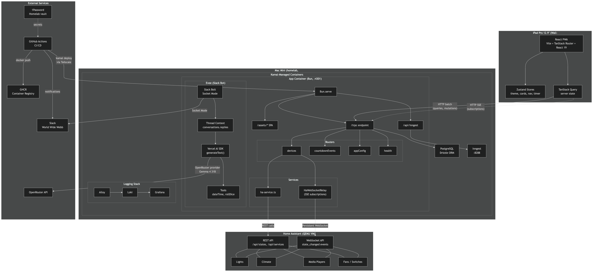
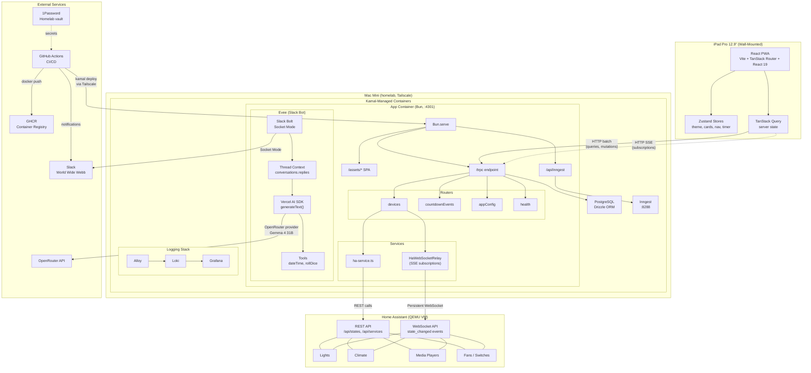
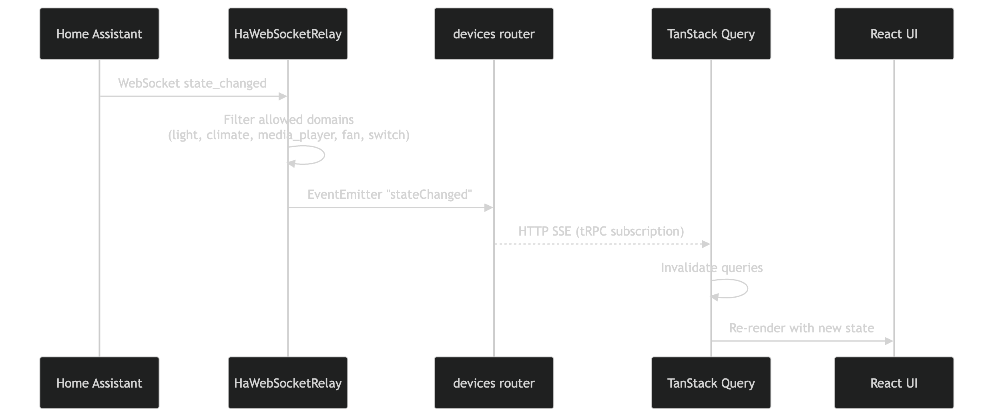
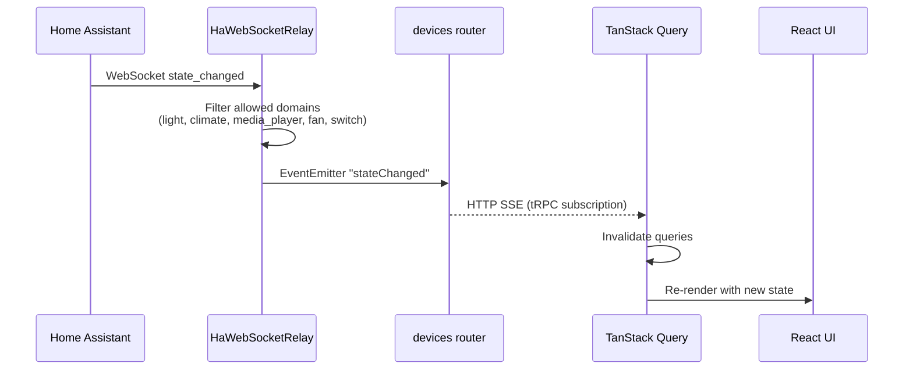
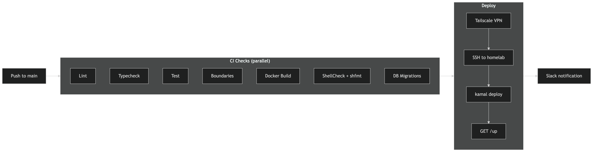
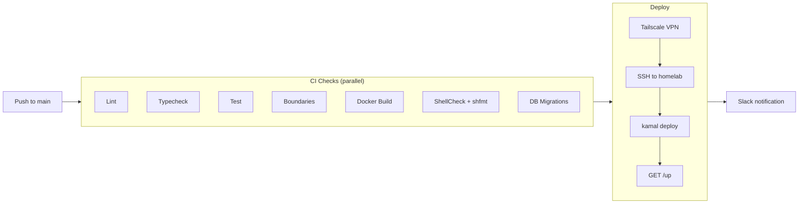

# Architecture

## System Diagram



<details>
<summary>Mermaid source</summary>



</details>

## Real-Time HA State Flow



<details>
<summary>Mermaid source</summary>



</details>

## CI/CD Pipeline



<details>
<summary>Mermaid source</summary>



</details>

## Monorepo Structure

```
the-workflow-engine/
  apps/
    web/         React SPA (Vite, TanStack Router, tRPC client)
    api/         tRPC API server (Bun, Drizzle ORM, Inngest, Evee)
  libs/
    shared/      Shared types and Zod schemas (@repo/shared)
  scripts/       Dev helpers, boundary checker, deploy
  docs/          Architecture, screenshots
  infra/         Kamal config, Evee manifest, logging
```

Workspace packages: `@repo/web`, `@repo/api`, `@repo/shared`.

## API Layers

The API enforces a layered architecture with strict import boundaries:

1. **db/**: Database schema and Drizzle client. Only imports `drizzle-orm`, `@repo/shared`.
2. **services/**: Business logic. Imports `db/`, `integrations/types`, `@repo/shared`.
3. **trpc/routers/**: HTTP endpoint definitions. Imports `services/`, `@trpc/*`, `zod`, tRPC init/context.
4. **inngest/functions/**: Background jobs. Imports `services/`, `inngest`, `@repo/shared`.
5. **integrations/**: Plugin implementations. Only imports `@repo/shared` and own files.

Boundaries enforced by `scripts/check-boundaries.ts` in pre-commit hooks and CI.

## Port Scheme

| Service  | Default Port | With PORT_OFFSET=N |
|----------|-------------|--------------------|
| Web      | 4200        | 4200 + N           |
| API      | 4201        | 4201 + N           |
| Inngest  | 8288        | 8288 + N           |

`PORT_OFFSET` (0-99) allows multiple instances to run side-by-side for parallel development.

## Local Development

Tilt orchestrates all services:

```bash
tilt up                        # Start everything
PORT_OFFSET=10 tilt up         # Start on offset ports
tilt down                      # Stop everything
```

Tilt starts: Docker Compose (Inngest + Postgres) -> API (bun --watch) -> Web (vite dev).
Secrets loaded from 1Password at dev start (HA_TOKEN, Slack tokens, OpenRouter key).

## Integration Plugin System

Plugins implement the `Integration` interface (`src/integrations/types.ts`):

- `init()`: One-time setup/authentication.
- `getState()`: Returns current state snapshot.
- `execute(command, params)`: Runs a command against the integration.
- `subscribe?(callback)`: Optional event stream, returns unsubscribe function.

Plugins are isolated: they may only import `@repo/shared` and their own files.
